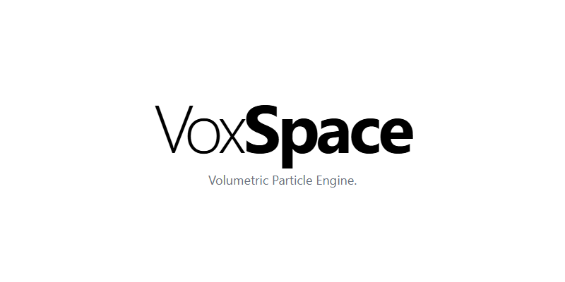
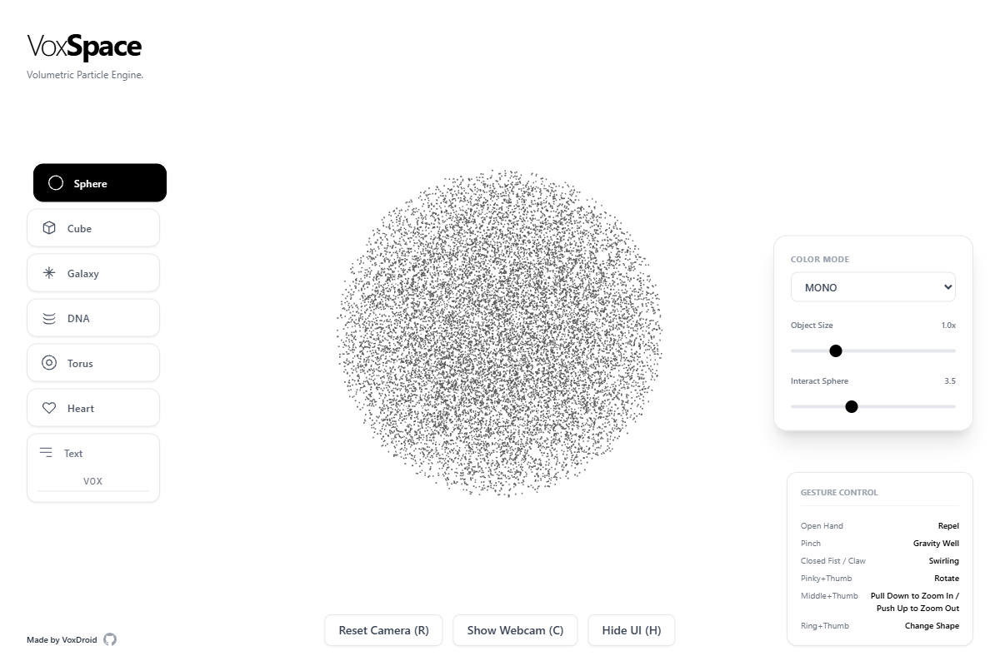

# VoxSpace

<p align="center">
  
</p>

<p align="center">
  
  
  
  
  
  
</p>

> **VoxSpace** - An interactive 3D particle visualization experience controlled by hand gestures using computer vision.

A cutting-edge web application that transforms your webcam into a magical controller for 3D particle systems. Use natural hand gestures to manipulate beautiful volumetric shapes in real-time.

## Features

| Category | Feature | Description |
|----------|---------|-------------|
| **Core Functionality** | Real-time Hand Tracking | Advanced computer vision using MediaPipe for precise gesture recognition |
| | 3D Particle Systems | Thousands of particles forming dynamic volumetric shapes |
| | Gesture-Based Controls | Intuitive hand movements for interaction, rotation, and zoom |
| | Multiple Shapes | Sphere, Cube, Galaxy, DNA Helix, Torus, Heart, and custom Text shapes |
| | Color Modes | 8 different color schemes including Rainbow, Fire, Ocean, and Cyber themes |
| **Visual Effects** | Dynamic Coloring | Velocity-based, spectrum-based, and depth-based color modes |
| | Smooth Animations | Fluid particle movements with physics-based interactions |
| | Interactive Physics | Attract, repel, and swirl effects based on hand proximity |
| | Responsive Design | Optimized for desktop and mobile devices |
| **Controls & Interaction** | Camera Controls | Reset camera position and toggle webcam visibility |
| | Shape Selection | Click or use gestures to cycle through different 3D forms |
| | Parameter Tuning | Adjust object scale, interaction radius, and particle density |
| | Keyboard Shortcuts | Quick access with **H** (UI), **R** (Reset), **C** (Camera) keys |

## Live Demo

Experience VoxSpace live: **[voxspace.vercel.app](https://voxspace.vercel.app)**

## Screenshots

<p align="center">
  
</p>

*Figure 1: VoxSpace main interface showing the 3D particle system with gesture controls.*

## Technology Stack

### Frontend Framework
- **React 19** - Modern React with concurrent features
- **TypeScript** - Type-safe development
- **Vite** - Lightning-fast build tool and dev server

### 3D Graphics & Visualization
- **Three.js** - Powerful 3D graphics library
- **React Three Fiber** - React renderer for Three.js
- **React Three Drei** - Useful helpers and abstractions

### Computer Vision & AI
- **MediaPipe Tasks Vision** - Google's computer vision framework
- **Hand Landmark Detection** - Real-time hand pose estimation
- **WebRTC** - Camera access and video processing

### UI & Styling
- **Tailwind CSS** - Utility-first CSS framework
- **Custom Components** - Hand-crafted UI elements
- **Responsive Design** - Mobile-first approach

## Prerequisites

- **Node.js** 18+ and npm
- **Modern Web Browser** with WebRTC support (Chrome, Firefox, Safari, Edge)
- **Webcam** for hand gesture control
- **HTTPS** for camera access (automatically provided in production)

## Installation & Setup

### Clone the Repository
```bash
git clone https://github.com/VoxDroid/VoxSpace.git
cd VoxSpace
```

### Install Dependencies
```bash
npm install
```

### Development Server
```bash
npm run dev
```
Open [http://localhost:5173](http://localhost:5173) in your browser.

### Build for Production
```bash
npm run build
```

### Preview Production Build
```bash
npm run preview
```

## Usage Guide

### Getting Started
1. **Allow Camera Access**: Grant permission when prompted
2. **Position Your Hand**: Center your hand in the camera view
3. **Start Interacting**: Use gestures to control the particles

### Hand Gesture Controls

| Gesture | Action | Description |
|---------|--------|-------------|
| **Open Hand** | Repel | Push particles away from your hand |
| **Pinch/Fist** | Gravity Well | Attract particles toward your palm center |
| **Closed Fist/Claw** | Swirling | Create rotational vortex effects |
| **Pinky + Thumb** | Rotate | Rotate the entire particle system |
| **Middle + Thumb** | Zoom | Pull down to zoom in, push up to zoom out |
| **Ring + Thumb** | Change Shape | Cycle through different 3D shapes |

### UI Controls

#### Shape Selection (Left Panel)
- Click any shape button to switch forms
- Text shape allows custom input (max 8 characters)
- Visual feedback shows current selection

#### Settings Panel (Right Panel)
- **Color Mode**: Dropdown with 8 color schemes
- **Object Size**: Scale the particle formation (0.5x - 2.5x)
- **Interact Sphere**: Adjust gesture detection radius (1-8 units)

#### Bottom Controls
- **Reset Camera (R)**: Return to default camera position
- **Show Webcam (C)**: Toggle camera preview visibility
- **Hide UI (H)**: Toggle interface visibility

### Keyboard Shortcuts
- **H**: Toggle UI visibility
- **R**: Reset camera position
- **C**: Toggle webcam preview

## Customization

### Adding New Shapes
```typescript
// In types.ts
export enum ShapeType {
  // Add your new shape
  MY_SHAPE = 'MY_SHAPE'
}
```

### Creating Color Modes
```typescript
// In ParticleSystem.tsx
} else if (colorMode === ColorMode.MY_COLOR) {
  // Your color logic here
  tmpColor.setHSL(hue, saturation, lightness);
}
```

### Custom Gestures
```typescript
// In WebcamHandler.tsx
// Add gesture detection logic
const myGesture = Math.sqrt(
  Math.pow(finger1.x - finger2.x, 2) +
  Math.pow(finger1.y - finger2.y, 2)
);
```

## Mobile Support

VoxSpace works on mobile devices with the following considerations:

- **Touch Controls**: Limited gesture support (work in progress)
- **Performance**: Reduce particle count for better performance
- **Camera**: Front-facing camera is used by default
- **Orientation**: Best experienced in landscape mode

## Deployment

### Vercel (Recommended)
```bash
# Install Vercel CLI
npm install -g vercel

# Deploy
vercel
```

### Other Platforms
The app can be deployed to any static hosting service:
- Netlify
- GitHub Pages
- AWS S3 + CloudFront
- Firebase Hosting

### Build Configuration
```javascript
// vite.config.ts
export default defineConfig({
  build: {
    rollupOptions: {
      output: {
        manualChunks: {
          three: ['three', '@react-three/fiber', '@react-three/drei'],
          mediapipe: ['@mediapipe/tasks-vision']
        }
      }
    }
  }
})
```

## Development

### Project Structure
```
voxspace/
├── public/
├── src/
│   ├── components/
│   │   ├── App.tsx           # Main application component
│   │   ├── ParticleSystem.tsx # 3D particle rendering
│   │   └── WebcamHandler.tsx  # Camera and gesture processing
│   ├── services/
│   │   └── visionService.ts   # MediaPipe integration
│   ├── types.ts               # TypeScript type definitions
│   └── utils/
│       └── geometryGenerators.ts # Shape generation utilities
├── package.json
├── tsconfig.json
├── vite.config.ts
└── README.md
```

### Key Components

#### App.tsx
- Main application state management
- UI layout and controls
- Keyboard event handling

#### ParticleSystem.tsx
- Three.js scene setup
- Particle physics and rendering
- Color mode implementations

#### WebcamHandler.tsx
- Camera initialization and streaming
- Hand landmark detection
- Gesture recognition logic

#### visionService.ts
- MediaPipe Tasks Vision wrapper
- Hand detection pipeline

## Contributing

We welcome contributions! Please follow these steps:

1. **Fork** the repository
2. **Create** a feature branch: `git checkout -b feature/amazing-feature`
3. **Commit** your changes: `git commit -m 'Add amazing feature'`
4. **Push** to the branch: `git push origin feature/amazing-feature`
5. **Open** a Pull Request

### Development Guidelines
- Use TypeScript for all new code
- Follow existing code style and patterns
- Test on multiple browsers
- Update documentation for new features

## Roadmap

### Planned Features
- *Multi-hand support* for collaborative interactions
- *Voice commands* integration with speech recognition
- *VR/AR support* for immersive experiences
- *Custom particle shaders* for advanced visual effects
- *Recording and playback* of gesture sequences

### Performance Improvements
- *WebAssembly optimization* for faster hand tracking
- *LOD (Level of Detail)* for large particle counts
- *GPU acceleration* for physics calculations

### Platform Support
- *Mobile app* versions for iOS and Android
- *Desktop application* with Electron
- *WebXR integration* for VR headsets

## License

This project is licensed under the MIT License - see the [LICENSE](LICENSE) file for details.

## Acknowledgments

- **Google MediaPipe** for the incredible computer vision capabilities
- **Three.js** community for the powerful 3D graphics framework
- **React** ecosystem for the amazing developer experience

## Support

- **Issues**: [GitHub Issues](https://github.com/VoxDroid/VoxSpace/issues)
- **Discussions**: [GitHub Discussions](https://github.com/VoxDroid/VoxSpace/discussions)
- **Email**: izeno.contact@gmail.com

---

**Made with ❤️ by VoxDroid**

Experience the future of human-computer interaction through the magic of computer vision and 3D graphics!